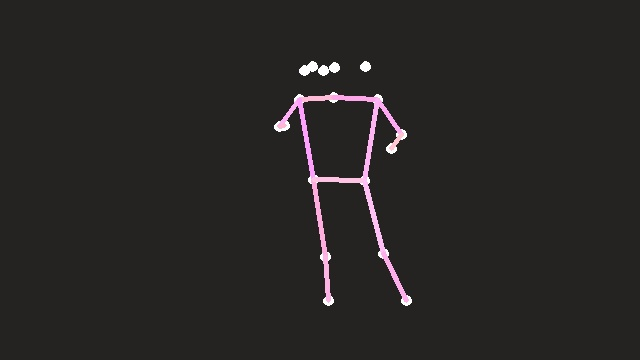

## CodingChallenge - InMyFeelings

This is a submission for this [this](https://youtu.be/prswDGGmYaE) video on Youtube by Siraj Raval as part of the #InMyFeelingsChallenge dance competition. The challenge is to create your own AI to dance to this song. The method used is: **Training an LSTM NNet** over data generated using hacky programming.

Being a newbie at ML, I've learned mostly by hitting the bottom of errors and climbing up. There are definitely better ways to code and tune this. Would be great if you can suggest any :) 
In this repository, I've uploaded:
1. [dataFactory](dataFactory.ipynb):
    It takes in a compilation of #InMyFeelingsChallenge dance videos and gives a audio video dataset for easy processing.(Generating points everytime I train NN, on my system, will take a lot of time). _Documentaion to be added_
2. [NNET](NNET.ipynb)
    It pre-processes datafiles from dataFactory and uses them as input to the NNet. I've created two different NNets for X and Y co-ordinates on the same features(audio data). Since the X co-ordinates vary a lot for a dancer(as compared to Y, which I realised in this project) NNet for X took more time and tuning to get satisfiable results. Also, I've scaled down the final predictions and joined custom POSE_PAIRS to generate the skeleton. 
    

### References:
1. [openPoseCV](https://github.com/CMU-Perceptual-Computing-Lab/openpose)
2. [Librosa](https://librosa.github.io/librosa/index.html)
3. [Deep Learning based Human Pose Estimation using OpenCV](https://www.learnopencv.com/deep-learning-based-human-pose-estimation-using-opencv-cpp-python/)
4. [LSTM Networks - The Math of Intelligence](https://www.youtube.com/watch?v=9zhrxE5PQgY&t=749s)

#### P.S> Not good enough AI, needs improvement :3
